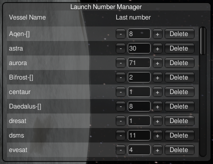

# KSPLaunchNumbering

A small mod to perform automatic numbering of launch vehicles.

This project is a fork of original [KSPLaunchNumbering by Damien-The-Unbeliever](https://github.com/Damien-The-Unbeliever/KSPLaunchNumbering) — a genuinely brilliant idea. Later, [linuxgurugamer](https://github.com/linuxgurugamer/KSPLaunchNumbering) took it further with a more feature-rich version, which is great in many ways too. However, I wasn't quite happy with how the numbering logic worked there, so I decided to roll my own implementation with slightly different approach.

The core idea is very simple: you put a `[tag]` in your vessel name, and the mod replaces it with a sequential number on each launch. I didn't want to use templates, mindblowing 'blocs', or Roman numerals. It's as simple as pie: just replace `[tag]` with a number.

## How It Works

Name your vessel with a `[tag]` placeholder, and the mod replaces it with an incrementing launch number.

**Examples:**

With a named tag:
```
Vessel-[vessel]     => first launch  renames to "Vessel-1"
Vessel-[vessel]     => second launch renames to "Vessel-2"
```

With an empty tag `[]` — the entire vessel name is used as the key:
```
Vessel-[]           => first launch  renames to "Vessel-1"
Vessel-[]           => second launch renames to "Vessel-2"
```

Each unique `[tag]` gets its own counter. Named tags and empty tags track independently.

### Mission Suffix / Comment

You can append any comment after a `#` sign. Everything from `#` onward is stripped during rename, so the number is applied only to the part before `#`.

The `#` suffix is useful for:

- **Mission tracking** — keep the same tag but note the destination or purpose
- **Variant notes** — document payload or configuration differences
- **Any extra info** — without interfering with the numbering sequence

**Examples:**

All three launches below use the same `[comsat]` tag and count sequentially, even though the comments differ:

```
ComSat-[comsat]#Keostationary    => renames to "ComSat-1"
ComSat-[comsat]#Mun network      => renames to "ComSat-2"
ComSat-[comsat]#Duna network     => renames to "ComSat-3"
```

As mrntioned above the comment is only visible in the editor before launch — once renamed, the vessel name becomes only what comes before `#`.

**Important:** Because the `#` comment is part of the vessel name in the editor, vessels with different comments are treated as **separate craft files** in the VAB/SPH. For example, `Vessel-[vessel]#Duna` and `Vessel-[vessel]#Minmus` are two different ships in the editor. After rollout, the comment is stripped and both will get sequential names like `Vessel-1` and `Vessel-2`.

## Launch Number Manager

Click the toolbar icon () in VAB, SPH, Flight, Map View, or KSC to open the **Launch Number Manager** window.

The window shows all tracked tags and their last launch numbers:



Entries are displayed in alphabetical order for easy navigation. For each entry you can:

- **Edit the number** directly in the text field
- **Decrement** using the `-` button (minimum value is 1)
- **Increment** using the `+` button
- **Delete** the entry entirely — the counter resets and the tag will start from 1 on next launch

The window closes by clicking the toolbar icon again.

## Settings

Open the game's settings (ESC => Settings => Game Difficulty) and find the **Launch Numbering** section. Toggle **Use Alternate Skin** to switch between KSP-native and default Unity skin for the manager window.

## Save Compatibility

Numbering data is persisted in your save file. If you uninstall the mod, any previously numbered vessels keep their names.

**Note:** This mod's save format is **not compatible** with the original mod by Damien-The-Unbeliever or the fork by linuxgurugamer. Do not switch between them mid-save — numbering data will not carry over.

## Installation

1. Download the latest release.
2. Extract the `GameData/LaunchNumbering` folder into your KSP `GameData/` directory.
3. The final structure should be:

```
   GameData/LaunchNumbering/
   ├── Plugins/
   │   └── LaunchNumbering.dll
   ├── Textures/
   │   └── LaunchNumbering.png
   ├── LICENSE
   └── README.md
```

## Building from Source

### Prerequisites

- [.NET Framework 3.5 SDK](https://dotnet.microsoft.com/download/dotnet-framework/net35) (Windows) or [Mono](https://www.mono-project.com/) (Linux)
- [MSBuild](https://github.com/dotnet/msbuild) (included with Visual Studio on Windows, or with Mono on Linux)
- A KSP installation with `KSP_Data/Managed/` containing the required assemblies

### Setup

1. Clone the repository:
   ```
   git clone https://github.com/crvx/KSPLaunchNumbering.git
   cd KSPLaunchNumbering
   ```

2. Create a symlink (Linux) or junction (Windows) named `KSP_Data` inside the `LaunchNumbering/` folder, pointing to your KSP installation's `KSP_Data` directory:

   **Linux:**
   ```bash
   ln -s /path/to/Kerbal\ Space\ Program/KSP_Data LaunchNumbering/KSP_Data
   ```

   **Windows (admin prompt):**
   ```cmd
   mklink /J LaunchNumbering\KSP_Data C:\Path\To\KSP\KSP_Data
   ```

   The `LaunchNumbering.csproj` references assemblies via `KSP_Data\Managed\*.dll`, so this symlink is required for compilation.

### Build

   ```bash
   msbuild LaunchNumbering/LaunchNumbering.csproj /p:Configuration=Release /t:Build
   ```

The compiled DLL will be at `LaunchNumbering/bin/Release/LaunchNumbering.dll`.

## License

MIT License. Originally by Damien-The-Unbeliever, maintained by crvx.
